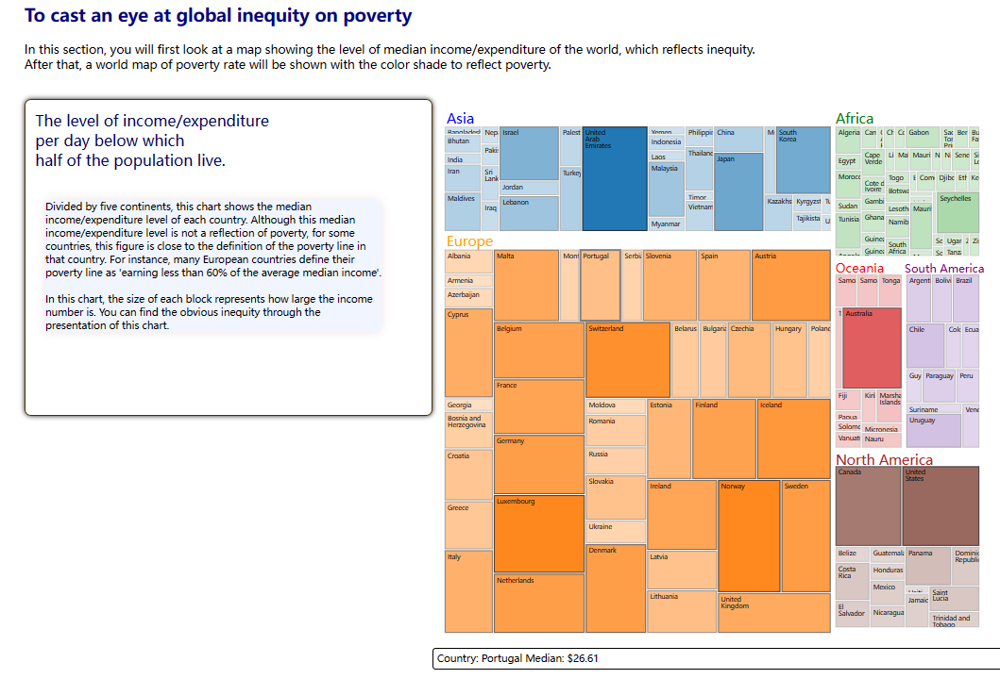

# Global Inequity in terms of Poverty

This folder contains all files for the Project.

## Install the packages
1. Install node.js modules by `npm install`
2. Install python packages and virtual environment under the python folder

## Data pre-processing
All the scripts needed for data pre-processing stage are contained in the folder ./python/

The script data_preprocessing.ipynb contained the dataset information and the necessary preprocessing steps such as imputation.

The script dimension_reduction.ipynb contained the steps carried out for dimension reduction of the dataset.

The results of pre-processed data are all stored in the folder ./python/data/

To feed the data into a database and later be used for visualization, you need to run the data_to_sqlite.ipynb first.
This script can read the data files under ./python/data/ and load them to a sqlite database. 
You can simply use run all from the VS code.

## Visualization
You should follow the steps to run the server for visualization:
1. Navigate to folder using `cd ./python`
2. Run the flask server first by using `python .\server.py`
   This way the node can read data from this flask server
3. Navigate back to the main folder if you are now in folder ./python, use `cd ..`
4. Run the website by using `npm run dev`
5. Open the link poped out in the terminal
6. Use Ctrl + C to close it.

The visualization pictures the level of inequity of poverty around the world. It has 4 sections:
1. Introdution
2. A general picture
    2.1 A tree map of median income/expenditure of each country.
    2.2 A world map of poverty which reflects the different level of poverty through color opacity.
3. Exploration of dataset
    It allows the user to explore the dataset with interactions.
4. Dimension reduction
    It shows the result of two dimension reduction methods (UMAP and MDS) with two scatterplots.
